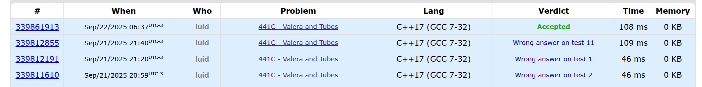
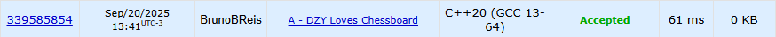
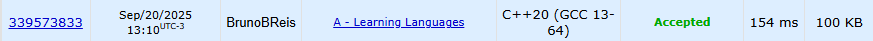
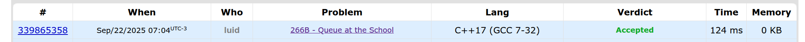

# Trabalho 2 - Grafos 2

**Número do trabalho:** 1  
**Conteúdo da Dsiciplina: Grafos Com Pesos**

## Alunos

| Matrícula |        Nome Completo       |
|:---------:|:-------------:|
| 221008285 | Luis Eduardo C M de Lima |
| 221007902 | Bruno Bragança Reis |

## Definição do trabalho

Para o Trabalho 2 a dupla optou por solucionar questões da plataforma **[CodeForces](https://codeforces.com/)**. Seguindo as orientações do professor Maurício Serrano, resolvemos 3 desafios. Dois do nível difícil e um do nível médio. Dessa maneira, a dupla busca demonstrar o conhecimento adquirido durante as aulas e estudos sobre o tema Grafos 2.

Sobre a realização do trabalho, cada exercício contém seu código resposta, screenshots da tela de submissão do **[CodeForces](https://codeforces.com/)** e vídeo de até 5 minutos explicando objetivamente as resoluções porpostas.

## Linguagem utilizada
*´Cpp´ e ´C´* 

## Screenshots

### Exercício 01 - Médio 
[Problem 441 - Valera and Tubes](https://codeforces.com/problemset/problem/441/C)

### Exercício 02 - Difícil
[Problem 445 - DZY Loves Chessboard](https://codeforces.com/problemset/problem/445/A)

### Exercício 03 - Difícil
[Problem 277 - Learning Languages](https://codeforces.com/problemset/problem/277/A)

### Exercício 04 - Difícil
[Problem 266 - Queue at the School](https://codeforces.com/problemset/problem/266/B)

## Vídeo de apresentação do Trabalho 2
[Vídeo](https://www.youtube.com)

### Links
Site usado para coletar exercícios
[Static A2OJ](https://a2oj.netlify.app/dfs%20&%20bfs%20&%20dijkstra)
[Moj](https://moj.naquadah.com.br/)
